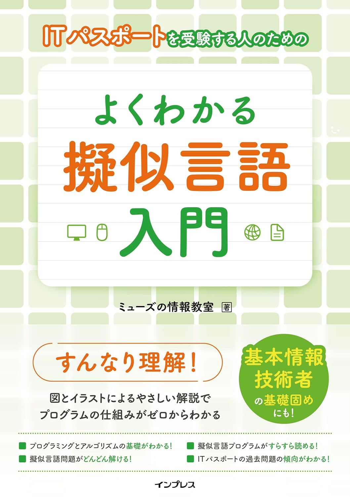
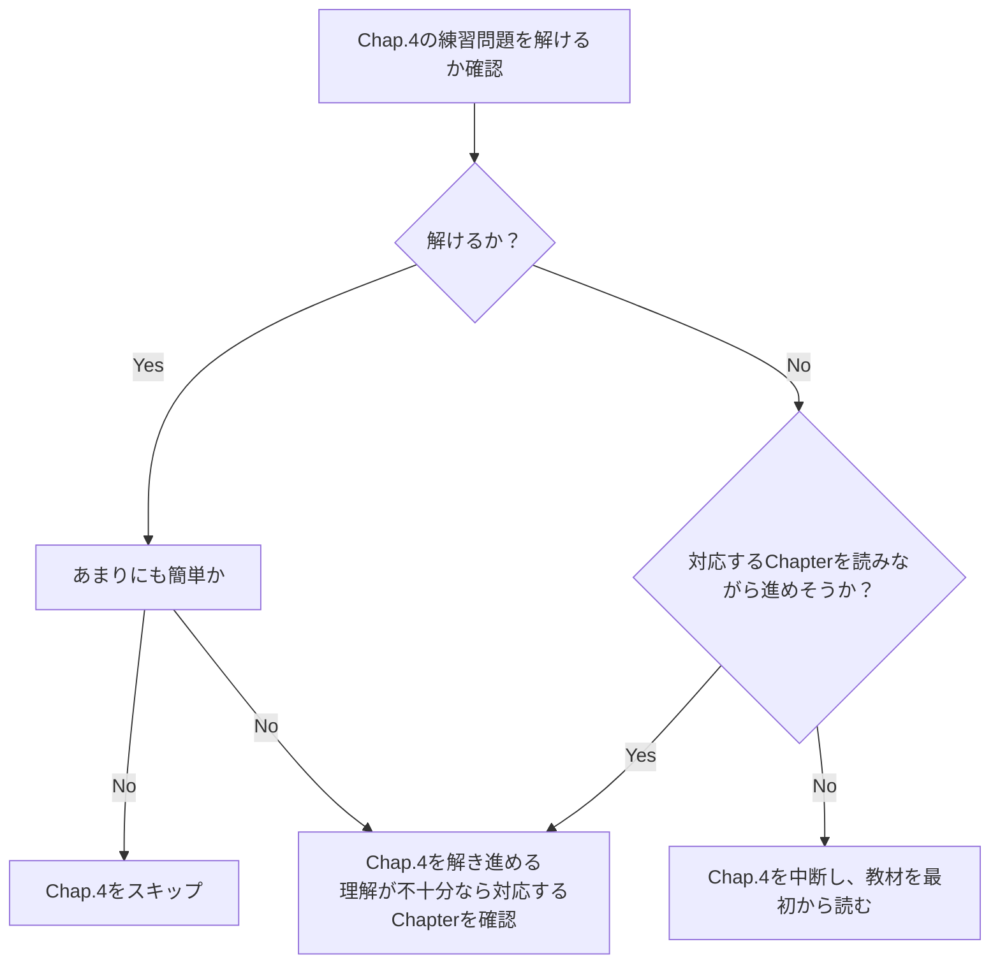

# アルゴリズムの教材

- 本リポジトリは、[IT パスポートを受験する人のための よくわかる擬似言語入門](https://www.amazon.co.jp/dp/B0CHRR6X39)の補足となる。以降、[IT パスポート試験のための よくわかる擬似言語入門](https://www.amazon.co.jp/dp/B0CHRR6X39)を**教材**と表記する。
- 擬似言語の文法は、教材を参照するか、[IPA の試験で使用する情報技術に関する用語・プログラム言語など](https://www.ipa.go.jp/shiken/syllabus/ps6vr7000000i9dp-att/shiken_yougo_ver5_0.pdf)を参照すること。

## 教材の学習の仕方

教材すべてに目を通す必要はない。疑似言語の文法や、演算記号など、**覚える必要はない**。見ながら回答できれば良い。

### 目標

**基本情報技術者試験を独学できるようにする**ラインを目指す。ポイントは以下参照。

- 以下が自分の口で説明できればよい
  - 順次構造・分岐構造・繰り返し構造
  - 配列・二次元配列
  - **関数・手続き**
    - 戻り値
    - 引数
    - return とは
    - 関数の呼び出し

現時点で、[基本情報技術者試験\_科目 B のサンプル問題](https://www.ipa.go.jp/shiken/syllabus/ps6vr7000000oett-att/fe_kamoku_b_sample.pdf)を独学で解けそうな場合は、学習は基本的に不要。その場合、担当者に相談すること。

### 教材の利用方法

順に実施すること。

---

🌟 前提として、不明な点などあれば気軽に質問してください。 
✨ 特に「関数・引数・戻り値」の理解は難しく、重要です。解説もするため、気軽に相談してください。💬

---

1. Chap.4 の練習問題

2. Chap.5 の練習問題
    1.  `1. Chap.4 の練習問題`と同様に進めること。スキップも可。
    2.  理解が不足、わからない場合は教材右上の**関連ページ**を参照すること。
3.  [追加課題](practice1/README.pdf)の実施
4.  さらなる追加課題の実施（相談すること）
